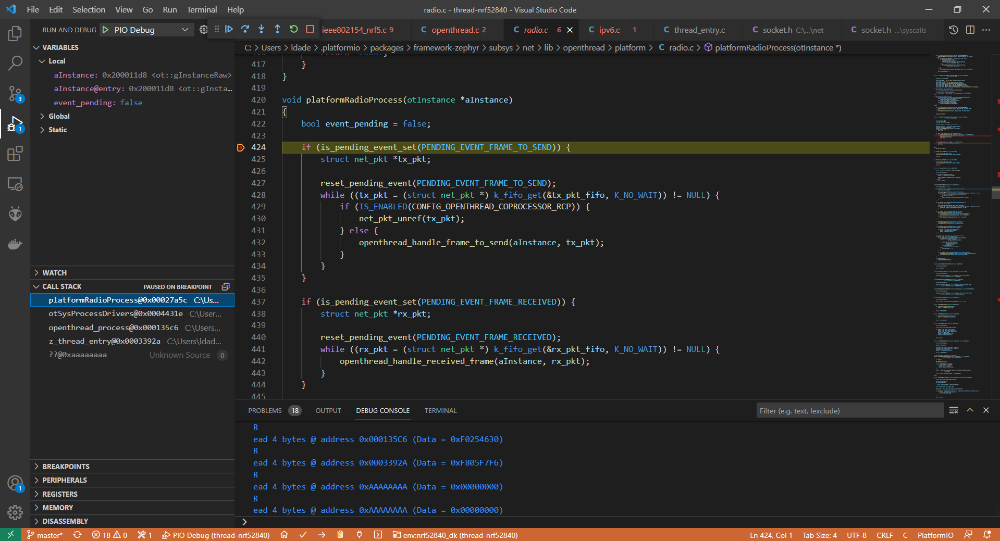
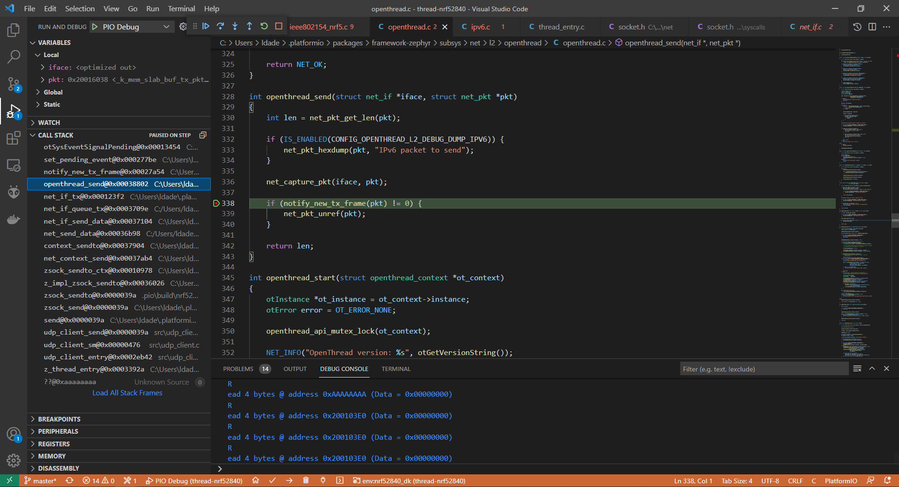
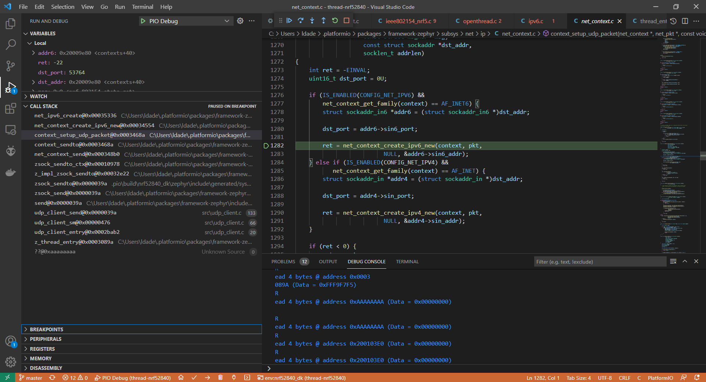

# Project 1

- UDP Client sending UDP packets to a server using Thread :

Thread Network was manually configured using openthread shell.

UDP server : 
```
dataset active -x
0e080000000000010000000300001935060004001fffe002080024aeb379debdb30708fd4a616d0f573b810510636f718d5b4a61d4672490104fc21ab4030f4f70656e5468726561642d3464323501024d2504101fdfd0f44861b7acc8d32d978817e92e0c0402a0fff8
Done
```

UDP Client :
```
ot dataset set active 0e080000000000010000000300001935060004001fffe002080024aeb379debdb30708fd4a616d0f573b810510636f718d5b4a61d4672490104fc21ab4030f4f70656e5468726561642d3464323501024d2504101fdfd0f44861b7acc8d32d978817e92e0c0402a0fff8
Done

ot thread start
```

Client Console : nrf52840dk zephyr rtos custom application: 

```
> Executing task: C:\Users\ldade\.platformio\penv\Scripts\platformio.exe device monitor --environment nrf52840_dk <

--- Available filters and text transformations: colorize, debug, default, direct, hexlify, log2file, nocontrol, printable, send_on_enter, time
--- More details at http://bit.ly/pio-monitor-filters
--- Miniterm on COM11  115200,8,N,1 ---
--- Quit: Ctrl+C | Menu: Ctrl+T | Help: Ctrl+T followed by Ctrl+H ---
[00:00:01.400,878] <inf> udp_client: UDP client ready to send to fd4a:616d:f57:3b81:31ff:3c7e:5961:ac51:1234
[00:00:01.400,878] <inf> udp_client: UDP client state change INIT > SENDING
[00:00:01.502,593] <inf> udp_client: successfully sent 82 bytes
[00:00:01.502,593] <inf> udp_client: UDP client state change SENDING > WAITING
[00:00:06.602,752] <inf> udp_client: UDP client state change WAITING > SENDING
[00:00:06.704,345] <inf> udp_client: successfully sent 82 bytes
[00:00:06.704,376] <inf> udp_client: UDP client state change SENDING > WAITING
[00:00:11.804,504] <inf> udp_client: UDP client state change WAITING > SENDING
[00:00:11.906,188] <inf> udp_client: successfully sent 82 bytes
[00:00:11.906,188] <inf> udp_client: UDP client state change SENDING > WAITING
[00:00:17.006,317] <inf> udp_client: UDP client state change WAITING > SENDING
[00:00:17.108,001] <inf> udp_client: successfully sent 82 bytes
[00:00:17.108,001] <inf> udp_client: UDP client state change SENDING > WAITING
```

Server Console : nrf52840dk as RCP for raspberry pi (openthread)
```
> udp open
Done
> udp bind :: 1234
Done
> ipaddr
fd4a:616d:f57:3b81:0:ff:fe00:fc11
fd4a:616d:f57:3b81:0:ff:fe00:fc38
fdac:dc73:bc50:d311:fc9c:d7a5:3da4:bec9
fd4a:616d:f57:3b81:0:ff:fe00:fc10
fd4a:616d:f57:3b81:0:ff:fe00:ec00
fd4a:616d:f57:3b81:31ff:3c7e:5961:ac51
fe80:0:0:0:d0f1:2295:34e6:6c1a
Done
*82 bytes from fd4a:616d:f57:3b81:93ba:8303:e027:a4b3 38153 Message °0 : Hello from Lucas' Applicationon nrf52840dk(Zephyr RTOS + OpenThread)
82 bytes from fd4a:616d:f57:3b81:93ba:8303:e027:a4b3 51347 Message °1 : Hello from Lucas' Applicationon nrf52840dk(Zephyr RTOS + OpenThread)
82 bytes from fd4a:616d:f57:3b81:93ba:8303:e027:a4b3 51347 Message °2 : Hello from Lucas' Applicationon nrf52840dk(Zephyr RTOS + OpenThread)
82 bytes from fd4a:616d:f57:3b81:93ba:8303:e027:a4b3 51347 Message °3 : Hello from Lucas' Applicationon nrf52840dk(Zephyr RTOS + OpenThread)
82 bytes from fd4a:616d:f57:3b81:93ba:8303:e027:a4b3 51347 Message °4 : Hello from Lucas' Applicationon nrf52840dk(Zephyr RTOS + OpenThread)
82 bytes from fd4a:616d:f57:3b81:93ba:8303:e027:a4b3 51347 Message °5 : Hello from Lucas' Applicationon nrf52840dk(Zephyr RTOS + OpenThread)
82 bytes from fd4a:616d:f57:3b81:93ba:8303:e027:a4b3 51347 Message °6 : Hello from Lucas' Applicationon nrf52840dk(Zephyr RTOS + OpenThread)
82 bytes from fd4a:616d:f57:3b81:93ba:8303:e027:a4b3 51347 Message °7 : Hello from Lucas' Applicationon nrf52840dk(Zephyr RTOS + OpenThread)
82 bytes from fd4a:616d:f57:3b81:93ba:8303:e027:a4b3 51347 Message °8 : Hello from Lucas' Applicationon nrf52840dk(Zephyr RTOS + OpenThread)
82 bytes from fd4a:616d:f57:3b81:93ba:8303:e027:a4b3 51347 Message °9 : Hello from Lucas' Applicationon nrf52840dk(Zephyr RTOS + OpenThread)
83 bytes from fd4a:616d:f57:3b81:93ba:8303:e027:a4b3 51347 Message °10 : Hello from Lucas' Applicationon nrf52840dk(Zephyr RTOS + OpenThread)
83 bytes from fd4a:616d:f57:3b81:93ba:8303:e027:a4b3 51347 Message °11 : Hello from Lucas' Applicationon nrf52840dk(Zephyr RTOS + OpenThread)
83 bytes from fd4a:616d:f57:3b81:93ba:8303:e027:a4b3 51347 Message °12 : Hello from Lucas' Applicationon nrf52840dk(Zephyr RTOS + OpenThread)

```

## Debug

```
CONFIG_OPENTHREAD_FULL_LOGS=n
CONFIG_OPENTHREAD_DEBUG=y
CONFIG_OPENTHREAD_LOG_LEVEL_DEBG=n
CONFIG_OPENTHREAD_LOG_LEVEL_INFO=y
CONFIG_OPENTHREAD_L2_DEBUG=n
CONFIG_OPENTHREAD_L2_DEBUG_DUMP_15_4=n
CONFIG_OPENTHREAD_L2_DEBUG_DUMP_IPV6=n
CONFIG_OPENTHREAD_L2_LOG_LEVEL_INF=n
```





# Todo

- Waiting for the interface to be up
- Factory reset make the application crash, maybe shell stack or workqueue stack is insufficient for the flash eraze ?

---


# Things

- [nRF Connect SDK - Working with Thread](https://developer.nordicsemi.com/nRF_Connect_SDK/doc/1.3.2/nrf/ug_thread.html)
- https://docs.platformio.org/en/latest/frameworks/zephyr.html#zephyr-modules
- https://docs.platformio.org/en/latest/frameworks/zephyr.html